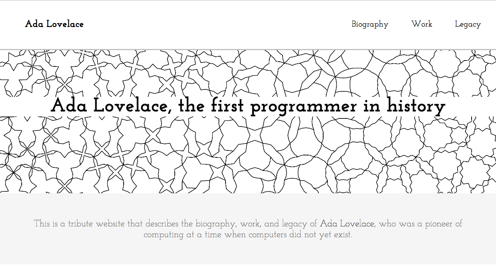
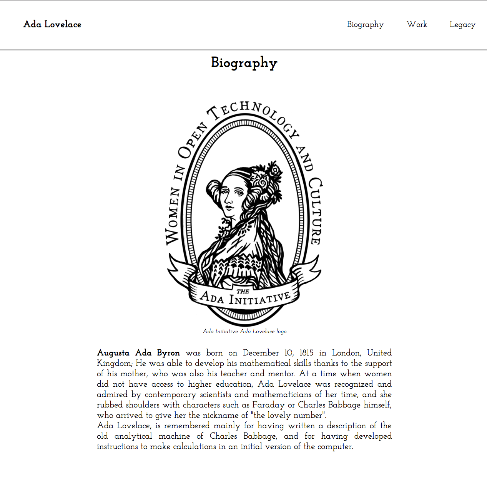
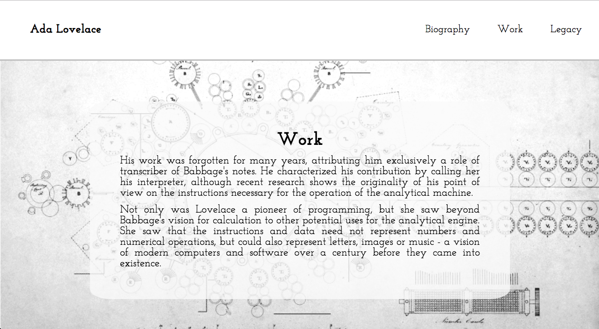

# Responsive Web Design Projects - Build a Tribute Page

[`Link to de website`](https://natcancein.github.io/ada-lovelace/)

This is the first responsive web design project for free code camp.
It is a tribute website to Ada Lovelace, the first programmer in history.

## The website is built with HTML5 and CSS3 language.

It consists of 3 sections:
- Biography
- Work
- Legacy

The parallax system was used (without the use of javascript), and mediaqueries for the site to be adapted to different mobile devices.

## Images of the website

