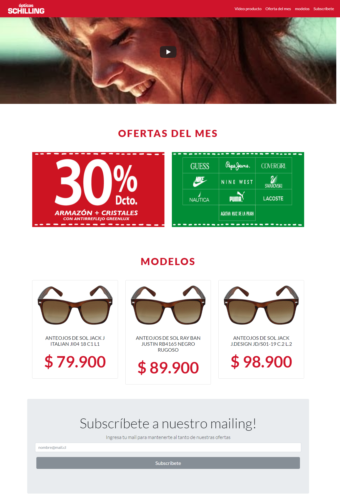

# Responsive Web Design Projects - Build a Product Landing Page

[`Link to website`](https://natcancein.github.io/FreeCodeCamp/ResponsiveWebDesignProjects/product-landing-page/)

This is the third responsive web design project for free code camp.

## The website is built with HTML5 and CSS3, Bootstrap 4 and Javascript (but it is a script obtained from [`Sorin Ruse`](https://codepen.io/sorinr/pen/qqQMZp)
.

It consists of 4 sections:

## Images of the website

